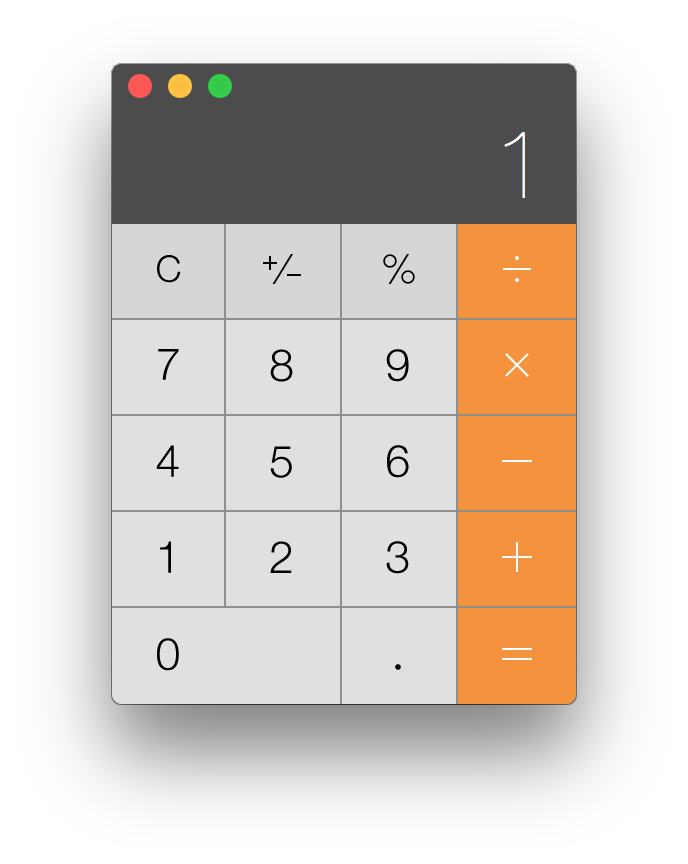

# Basic JS Calculator - Mini Project

## Objectives

Create a basic (non scientific) calculator that can do  basic arithmetic operations. A basic user interface that is usable is necessary.

It should look something like this:

## Quick Start

1. Fork this repository (click the button "Fork" located in the upper left corner of the screen)
2. Once the [fork](https://help.github.com/articles/fork-a-repo/) is complete, clone the repository from your GitHub profile and begin to work locally using a "feature branch" (one that is not master). Then use the standard Git workflow we learned in class.

### Basic functionality (required):

- Addition
- Substraction
- Multiplication
- Division

### Additional functionality (optional stretch goal)
- Ability to enter negative numbers `+/-`
- Add the `.` so that number with decimals can be used
- Add the `%` to get percentages

### Additional requirements:
- A JS Module Pattern **must** be used
- Use jQuery to manipulate DOM elements

